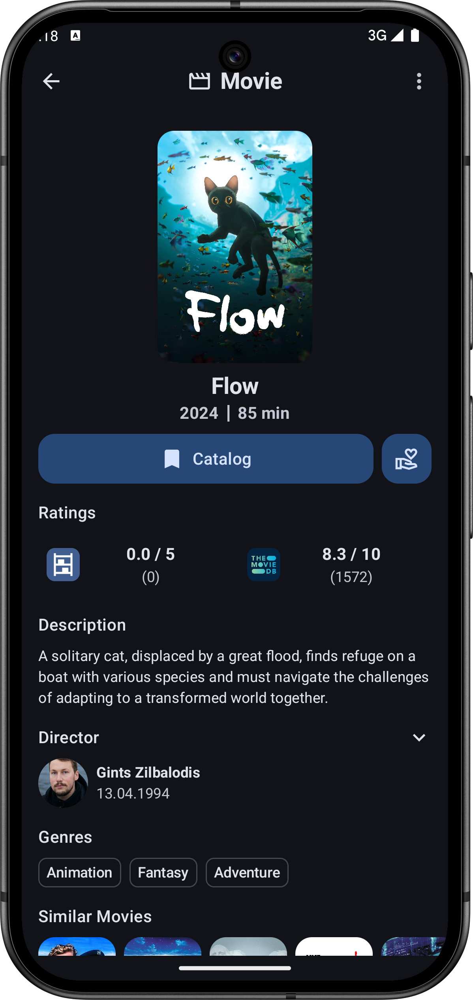
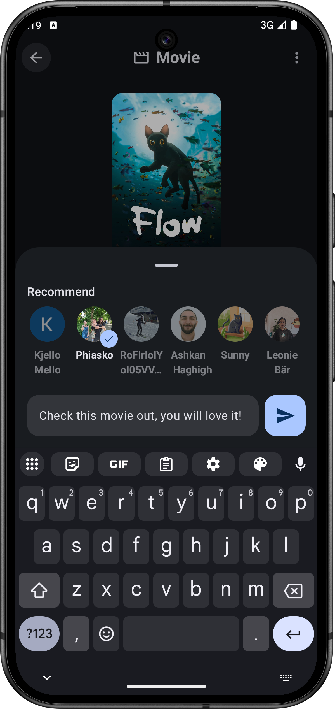

# OnTrack - Shelf & Share Media

**OnTrack** is a **multiplatform mobile app** for **Android** and **iOS**, designed to be your **central hub** for tracking and sharing all kinds of media. Whether you're into **movies**, **shows**, **books**, **video games**, **board games**, or **albums**, OnTrack helps you organize, track, and share your experiences with close friends.

  

---

## ✨ Features

📚 **Track All Your Media - In One Place**  
Track your favorite **Movies**, **Books**, **Shows**, **Video Games**, **Board Games**, and **Albums** — all in one app.

🎯 **Status Tracking Simplified**  
Easily organize your media by status:
- **Catalog** (want to engage with)
- **Consuming** (currently watching/reading/playing/listening)
- **Consumed** (completed)
- **Dropped** (gave up on)

📰 **Shared Feed**  
See what your friends are tracking and consuming. Share your thoughts and engage through a **shared activity feed**.

🤝 **Send Recommendations**  
Suggest media directly to your friends! Share the love for the things you enjoy.

🔗 **Cross-Platform Support**  
OnTrack runs on both **Android** and **iOS**, offering a seamless experience on both platforms.

---

## 📱 Screenshots

  
  
  
  
  
  
  

---

## ⚙️ Technologies Used

| 🛠️ Tech                 | 💡 Description                          |
|-------------------------|-----------------------------------------|
| **Kotlin Multiplatform** | Shared codebase for Android and iOS    |
| **Compose Multiplatform**| UI toolkit for a consistent look & feel|
| **Ktor**                | HTTP client for API communication      |
| **Firebase**            | Authentication, crashlytics, analytics, cloud functions, messages, storage |
| **Koin**                | Lightweight Dependency Injection       |

---

## 🚀 Goals of OnTrack

🎯 Provide a **centralized space** to manage media consumption  
👥 Encourage **social engagement** by sharing activity with close friends  
📚 Reduce app-switching fatigue by **tracking all media types in one app**  
📬 Make it **easy to recommend** and discover new media from friends

---

## 🔗 Installation

> **Coming Soon**  
> Stay tuned for the app release on:  
> 📲 [Google Play Store](#)  
> 🍏 [Apple App Store](#)

---

## 🧑‍💻 Contributors

| Name | Role                      |
|------|---------------------------|
| Ashkan Haghighi Fashi  | UI Designer & App Developer  |
| Quan Vu Anh  | Backend & Infrastructure Developer  |

